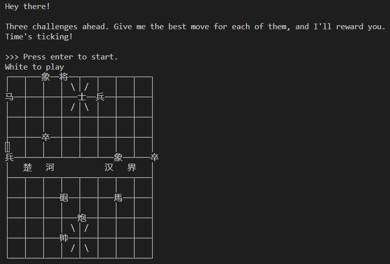
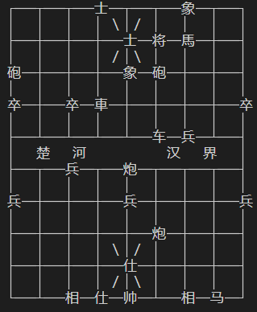
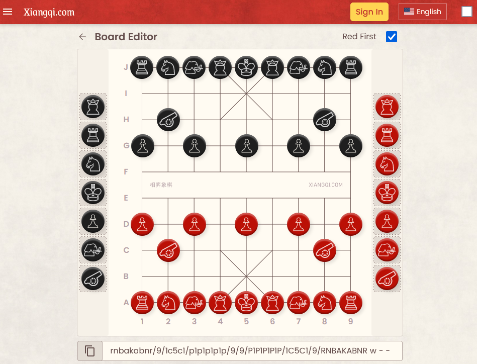
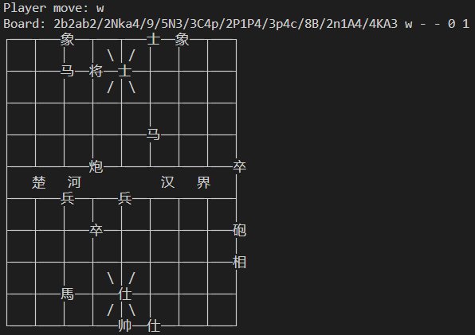
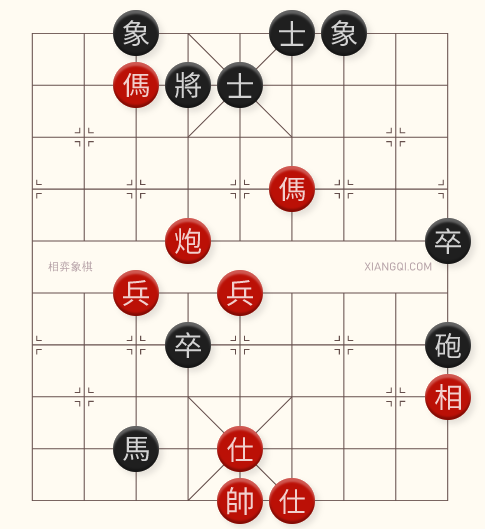

# AthackCTF 2024: egyptian-chess

**Category:** misc, ppc (professional programming challenges)

**Difficulty:** Hard (1 solve)

**Author:** Hugo

**Attachments:** [asd.py](./attachments/asd.py)

This year, the rest of the Shell We Hack? team and I travelled to Montreal to compete in-person at AthackCTF 2024. The competition was difficult and fun, and after 23 hours we managed to secure 2nd place. Alongside this accomplishment, we were the only team to solve the egyptian-chess challenge. Here's how we did it.



<!-- more -->

## First Look

After starting an instance of egyptian-chess, we can connect using netcat. Upon connecting, we are told there are three challenges and we must provide the best move for each. After clicking enter, we are presented with the first challenge.

The first challenge tells us its white's turn, and we are given a printout of a board.

Typing random text for a move and clicking enter prints out `Wrong :(` and terminates the connection.

```
$ nc 192.168.20.87 12345
Hey there!

Three challenges ahead. Give me the best move for each of them, and I'll reward you.
Time's ticking!

>>> Press enter to start.
White to play
┌───┬───┬───士──┬───┬───象──┬───┐
│   │   │   │ ＼│／ │   │   │   │
├───┼───┼───┼───士──将──馬──┼───┤
│   │   │   │ ／│＼ │   │   │   │
砲──┼───┼───┼───象──砲──┼───┼───┤
│   │   │   │   │   │   │   │   │
卒──┼───卒──車──┼───┼───┼───┼───卒
│   │   │   │   │   │   │   │   │
├───┴───┴───┴───┴───车──兵──┴───┤
│   楚   河           汉   界   │
├───┬───兵──┬───炮──┬───┬───┬───┤
│   │   │   │   │   │   │   │   │
兵──┼───┼───┼───兵──┼───┼───┼───兵
│   │   │   │   │   │   │   │   │
├───┼───┼───┼───┼───炮──┼───┼───┤
│   │   │   │ ＼│／ │   │   │   │
├───┼───┼───┼───仕──┼───┼───┼───┤
│   │   │   │ ／│＼ │   │   │   │
└───┴───相──仕──帅──┴───相──马──┘
asd
Wrong :(
```

Note: Throughout this writeup, we will use the text copies of outputs, which will not be aligned nicely. The board does look nice in the terminal, however:



## Finding the game

The first step to solving this challenge was to figure out what game the challenge was. After an embarrasingly long rabbit-hole of Ancient Egyptian board games, one of our members used Google Lens to figure out the game was [Xiangqi](https://en.wikipedia.org/wiki/Xiangqi) commonly referred to as Chinese chess.

After determining the game, we did some basic research on the game to determine the rules (very similar to standard chess). We also found an online Xiangqi platform ([play.xiangqi.com](https://play.xiangqi.com/)) that allows you to play against a computer and [edit](https://play.xiangqi.com/editor)/[analyze](https://play.xiangqi.com/analysis/board) boards.



## First Idea

The analysis feature of the website also determines the next best move. The first idea we had was to:

1. Receive the printed board from the netcat connection.
2. Translate the printed board to the notation the website used (later identified as FEN notation).
3. Use the analysis feature to determine the best move.
4. Input the best move to the netcat connection.

## Starting the solve script

We started by creating a Python script to interact with the server. For this, we used [pwntools](https://github.com/Gallopsled/pwntools):

```python
from pwn import *

# This was occasionally uncommented to debug errors.
#context.log_level = 'debug'

REMOTE_HOST = '192.168.20.87'
REMOTE_PORT = 12345

conn = remote(REMOTE_HOST, REMOTE_PORT)

# skip the banner
conn.recvuntil(b'>>> Press enter to start.')
conn.sendline()

conn.interactive()
```

This script opened a socket (similar to netcat), skipped the initial output, sent the first enter, and then put the script into interactive mode which works the same as netcat.

Running this script gives us:

```sh
[+] Opening connection to 192.168.20.87 on port 12345: Done                                                        
[*] Switching to interactive mode
Black to play
┌───┬───┬───士──将──士──┬───┬───┐
│   │   │   │ ＼│／ │   │   │   │
├───┼───┼───馬──┼───┼───┼───┼───┤
│   │   │   │ ／│＼ │   │   │   │
├───車──┼───┼───象──┼───┼───┼───┤
│   │   │   │   │   │   │   │   │
├───┼───┼───┼───┼───┼───┼───┼───马
│   │   │   │   │   │   │   │   │
├───┴───┴───┴───┴───┴───┴───┴───┤
│   楚   河           汉   界   │
├───┬───相──┬───兵──┬───┬───┬───┤
│   │   │   │   │   │   │   │   │
├───┼───┼───┼───┼───┼───┼───┼───兵
│   │   │   │   │   │   │   │   │
├───┼───馬──┼───┼───┼───┼───┼───┤
│   │   │   │ ＼│／ │   │   │   │
├───┼───┼───车──┼───┼───┼───┼───┤
│   │   │   │ ／│＼ │   │   │   │
└───┴───┴───┴───帅──仕──相──砲──┘
$
```

## Reading the board

Taking a closer look at the output, we can see that the board output is:

- 1 line determining whose turn it is.
- 19 lines displaying the pieces on the board.

Updating a script to parse these outputs:

```python
from pwn import *

#context.log_level = 'debug'

REMOTE_HOST = '127.0.0.1' # '192.168.20.87'
REMOTE_PORT = 12345

conn = remote(REMOTE_HOST, REMOTE_PORT)

# skip the banner
conn.recvuntil(b'>>> Press enter to start.')
conn.sendline()

def read_player_move():
    # "Black to play", "White to play"
    player_move_line = conn.recvline().decode()
    player_move = player_move_line[0].lower()
    return player_move # returns 'w' or 'b'

def read_board_text():
    board_text = b'\n'.join(conn.recvlines(19)) # read 19 lines
    board_text = board_text.decode() # decode to string
    return board_text

player_move = read_player_move()
print('Player move:', player_move)

board_text = read_board_text()
print('Board text:')
print(board_text)
```

Running this script:

```
[+] Opening connection to 192.168.20.87 on port 12345: Done                                                        
Player move: w
Board text:
┌───┬───┬───┬───┬───┬───象──┬───炮
│   │   │   │ ＼│／ │   │   │   │
├───┼───┼───┼───┼───将──車──┼───┤
│   │   │   │ ／│＼ │   │   │   │
馬──┼───┼───士──兵──┼───┼───┼───┤
│   │   │   │   │   │   │   │   │
├───┼───┼───马──┼───┼───┼───┼───┤
│   │   │   │   │   │   │   │   │
├───┴───┴───┴───┴───┴───┴───┴───┤
│   楚   河           汉   界   │
├───┬───┬───┬───┬───┬───┬───┬───┤
│   │   │   │   │   │   │   │   │
├───┼───┼───┼───┼───┼───┼───┼───┤
│   │   │   │   │   │   │   │   │
├───┼───┼───┼───┼───┼───┼───┼───┤
│   │   │   │ ＼│／ │   │   │   │
├───┼───┼───┼───仕──┼───┼───┼───┤
│   │   │   │ ／│＼ │   │   │   │
└───┴───相──砲──帅──┴───┴───车──┘
[*] Switching to interactive mode
$
```

Next up was to convert the board text to a 2D array so we can easier work with it:

```python
...
def parse_board_text(board_text):
    board = []
    for line in board_text.splitlines():
        # split the line by the horizontal line character
        # and only keep non-empty pieces
        pieces = [x for x in line.split('─') if x != '']
        if len(pieces) != 9:
            continue
        for piece in pieces:
            board.append(pieces)
    return board

player_move = read_player_move()
print('Player move:', player_move)

board_text = read_board_text()
board = parse_board_text(board_text)
print('Board:', len(board[0]), 'x', len(board))
print(board)
```

Which outputs:

```
Player move: w
Board: 9 x 10
[['┌', '┬', '┬', '炮', '┬', '将', '┬', '┬', '┐'], ...]
```

This includes some of the intersection lines. We can change these to `None` to indicate no piece in that position.

```python
...
def parse_board_text(board_text):
    non_pieces = ['┼', '┬', '┴', '┤', '├', '┌', '┐', '└', '┘']
    board = []
    for line in board_text.splitlines():
        # split the line by the horizontal line character
        # and only keep non-empty pieces
        pieces = [x for x in line.split('─') if len(x) > 0]
        if len(pieces) != 9:
            continue
        # replace non-piece characters with None
        pieces = [(None if x in non_pieces else x) for x in pieces]
        board.append(pieces)
    return board
...
```

Which outputs:
```
Player move: w
Board: 9 x 10
[[None, None, None, None, '将', '士', None, None, None], ...]
```

## Translating the board

The next step was translating our 2D array with Chinese characters to FEN notation. FEN notation is the notation used by the analysis website. It looks like this:

```
rnbakabnr/9/1c5c1/p1p1p1p1p/9/9/P1P1P1P1P/1C5C1/9/RNBAKABNR w - - 0 1
```

After playing with the board editor, and watching how the notation changed, we determined:

1. `/` splits the lines on the board.
2. The lines separated by `/` run from top-to-bottom.
3. Lower-case characters are black pieces. Upper-case characters are red/white pieces.
4. A number indicates an amount of blank spaces on the line.
5. After the lines, the letter indicates whose turn it is `w` or `b`.
6. We have no clue what `- - 0 1` means.

The board editor site also allows us to switch the pieces to Chinese character notation. Which allowed us to get a decent translation between english and chinese characters. This translation was not perfect however. After an hour or two of trial and error, we finally managed to find a translation that worked.

First, we added the translation mechanism to the `parse_board_text` function:

```python
...
def parse_board_text(board_text):
    non_pieces = ['┼', '┬', '┴', '┤', '├', '┌', '┐', '└', '┘']
    translation = {
        '将': 'k', '士': 'a', '象': 'b', '馬': 'n', '車': 'r', '砲': 'c', '卒': 'p',
        '帅': 'K', '仕': 'A', '相': 'B', '马': 'N', '车': 'R', '炮': 'C', '兵': 'P',
        '┼': None, '┬': None, '┴': None, '┤': None, '├': None, '┌': None, '┐': None, '└': None, '┘': None
    }
    board = []
    for line in board_text.splitlines():
        # split the line by the horizontal line character
        # and only keep non-empty pieces
        pieces = [x for x in line.split('─') if len(x) > 0]
        if len(pieces) != 9:
            continue
        # replace non-piece characters with None
        pieces = [(None if x in non_pieces else translation[x]) for x in pieces]
        board.append(pieces)
    return board
...
```

Then we added a `convert_board_to_fen` function:
```python
...
def convert_board_to_fen(board, player_move):
    board_fen = ''
    for line in board:
        spaces = 0
        # iterate over pieces in line
        for piece in line:
            # increment spaces
            if piece == None:
                spaces += 1
                continue
            # append spaces and reset spaces
            elif spaces > 0:
                board_fen += str(spaces)
                spaces = 0
            # append piece
            board_fen += piece
        # append remaining spaces
        if spaces > 0:
            board_fen += str(spaces)
            spaces = 0
        # add line separator
        board_fen += '/'

    board_fen = board_fen[:-1] # trim last /
    board_fen += ' ' + player_move + ' - - 0 1'

    return board_fen

player_move = read_player_move()
print('Player move:', player_move)

board_text = read_board_text()
board = parse_board_text(board_text)

board_fen = convert_board_to_fen(board, player_move)
print('Board:', board_fen)
print(board_text)

conn.interactive()
```

Running this script gives us the following output:

(`2b2ab2/2Nka4/9/5N3/3C4p/2P1P4/3p4c/8B/2n1A4/4KA3 w - - 0 1`)


Which when pasted into the [Xiangqi board editor](https://play.xiangqi.com/editor/), matches the display:



## Getting the best move (manual approach)

Now that we have successfully translated the board, we can perform analysis on it. In the online board editor, we can simply click **Analyze** and get the next best move. For the previous output, this would be `A5A4`.

One of the example moves provided in the challenge description is `h9h10`. However, in the online board editor, left-to-right is 1-9. This indicated that the board editor and the challenge server used different coordinate systems. So if the recommended move is `A5A4` on the board editor, it would actually be `e1d1`.

We added a component to our work-in-progress script to automatically convert this for us, but this is not included in this writeup as it was not part of our final solution.

Now we had a manual method of getting the next best move. So we carried out the following:

1. Ran our script.
2. Copied the board's FEN notation to the [online board editor](https://play.xiangqi.com/editor/).
3. Clicked **Analyze**.
4. Received the next best move. Converted it to the correct orientation.
5. Entered the next best move into the terminal and clicked enter.
6. Received the following output:
    ```
    Correct!
    Too slow :(
    ```

Darn. After trying to speed up the manual process in many ways, we still could not beat the timer. So we had to find a way to get the next best move automated.

## Getting the best move (automatically)

The most popular chess engine is [Stockfish](https://stockfishchess.org/) which is open-source and allows a computer to analyze chess positions. A fork of Stockfish, called [Fairy-Stockfish](https://github.com/fairy-stockfish/Fairy-Stockfish) allows you to use Stockfish with different variants of chess, such as Chess960 but also Xiangqi.

Unfortunately, after a lot of trial and error, we could not get Fairy-Stockfish to provide best moves for Xiangqi boards. After doing a lot of research, we finally realized that the answer was there all along. The online board editor showed what chess engine it was using: Pikafish.

A quick Google search for Pikafish showed brought up its [GitHub page](https://github.com/official-pikafish/Pikafish). We downloaded the (at the time) [latest release](https://github.com/official-pikafish/Pikafish/releases/tag/Pikafish-2023-12-03), and extracted it in our challenge folder. After a couple of tries, we found the `./Pikafish.2023-12-03/Linux/pikafish-sse41-popcnt` executable ran well on our machines.

After reading the documentation for Pikafish, we determined we needed the following inputs into the engine to get the best move for a given board:
```
setoption name EvalFile value ./Pikafish.2023-12-03/pikafish.nnue
position fen "3R1a3/5c3/2N2k3/2N6/5P3/9/8P/4BA3/5Kn2/2B1r4 w - - 0 1"
go depth 20
```

The above input:

1. Set's the NNUE file for the Pikafish engine (used to determine best moves).
2. Sets the board.
3. Analyzes the board up to a depth of 20.

The Pikafish engine then prints:
```
info string NNUE evaluation using ./Pikafish.2023-12-03/pikafish.nnue enabled
info depth 1 seldepth 1 multipv 1 score mate 1 nodes 42 nps 21000 hashfull 0 tbhits 0 time 2 pv d9d7
info depth 2 seldepth 2 multipv 1 score mate 1 nodes 75 nps 37500 hashfull 0 tbhits 0 time 2 pv d9d7
...
info depth 20 seldepth 2 multipv 1 score mate 1 nodes 669 nps 334500 hashfull 0 tbhits 0 time 2 pv d9d7
bestmove d9d7
```

Note: The output of the best move used zero as the lowest index instead of one. So we will need to convert this in our script.

We already have pwntools in our script, so we can use it to start the engine as a process and interface with it:

```python
ENGINE_PATH = './Pikafish.2023-12-03/Linux/pikafish-sse41-popcnt'
NNUE_PATH = './Pikafish.2023-12-03/pikafish.nnue'

...

# start the pikafish engine
engine = process(ENGINE_PATH)
engine.recvline()
engine.sendline(f'setoption name EvalFile value {NNUE_PATH}'.encode())

...

def get_best_move(board_fen):
    engine.sendline(f'position fen "{board_fen}"'.encode())
    engine.sendline(b'go depth 20')
    engine.recvuntil(b'bestmove ')
    move = engine.recvline().decode().split()[0]
    # convert 0-based to 1-based: a0a2 -> a1a3
    move = move[0] + str(int(move[1])+1) + move[2] + str(int(move[3])+1)
    return move

player_move = read_player_move()
print('Player move:', player_move)

board_text = read_board_text()
board = parse_board_text(board_text)

board_fen = convert_board_to_fen(board, player_move)
print('Board:', board_fen)
#print(board_text)

best_move = get_best_move(board_fen)
print('Best move:', best_move)
conn.sendline(best_move.encode())

conn.interactive()
```

Running our script with the Pikafish additions outputs:

```
Player move: w
Board: 2bnka3/1r2a4/4N4/p1p3R1p/7n1/2P6/P2Rcr3/2N1C4/4A4/2BK1AB2 w - - 0 1
Best move: e8c9
[*] Switching to interactive mode
Correct!
White to play
車──馬──┬───車──将──士──象──砲──┐
...
└───┴───┴───仕──┴───帅──相──┴───┘
$
```

We solved the first of the three challenges! And in time!

## Final Script

Now, we just need to edit our script to do all three. The final solve script is included as the [asd.py attachment](./attachments/asd.py).

```python
...

for i in range(3):
    player_move = read_player_move()
    print('Player move:', player_move)

    board_text = read_board_text()
    board = parse_board_text(board_text)

    board_fen = convert_board_to_fen(board, player_move)
    print('Board:', board_fen)

    best_move = get_best_move(board_fen)
    print('Best move:', best_move)
    conn.sendline(best_move.encode())
    
    result = conn.recvline().decode()
    print(result)

conn.interactive()
```

Running the final script:

```
[+] Opening connection to 192.168.20.87 on port 12345: Done                                                        
[+] Starting local process './Pikafish.2023-12-03/Linux/pikafish-sse41-popcnt': pid 497
Player move: w
Board: 3k5/c2na4/3PbN3/p8/3C2Nnp/9/P1p5P/9/9/2BAKAB2 w - - 0 1
Best move: d8e8
Correct!

Player move: b
Board: 2ba1kb2/4a4/2N2c3/p1R1p4/2p1c1p2/9/P6rP/C3C4/4A4/2BAK1B2 b - - 0 1
Best move: h4h1
Correct!

Player move: w
Board: 4kab2/1R2a4/r3b1R2/p2rC1p1p/9/2P3P2/P3P3P/2c6/4A4/2BAK1B2 w - - 0 1
Best move: b9e9
Correct!

[*] Switching to interactive mode
Good job! Here's the flag: ATHACKCTF{X1anGqiForTheW111N!}
[*] Got EOF while reading in interactive
$ 
```

And we got the flag!

```
ATHACKCTF{X1anGqiForTheW111N!}
```

**Thanks to the ATHACK team for hosting an amazing in-person event with some very interesting challenges.**