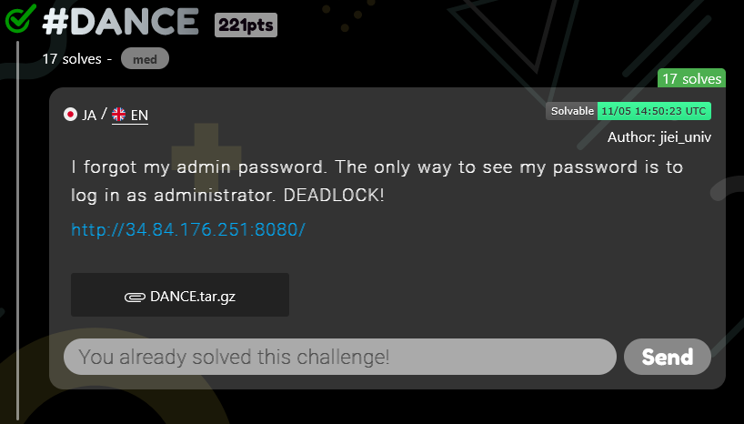
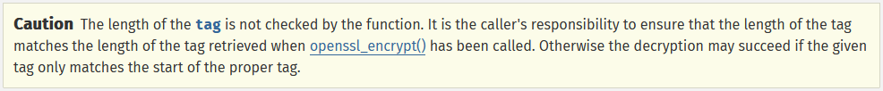

# TSGCTF 2023: #DANCE writeup

**Category:** web, crypto

**Difficulty:** Medium (17 solves)

**Author:** [@jiei_univ](https://twitter.com/jiei_univ)

**Prompt:**
> I forgot my admin password. The only way to see my password is to log in as administrator. DEADLOCK!
> 
> http://34.84.176.251:8080/

**Attachments:** [*asd.py*](./attachments/asd.py), [*DANCE.tar.gz*](./attachments/DANCE.tar.gz)



<!-- more -->

## #DANCE: Viewing the source code

Taking a first look at the challenge, we are given a [DANCE.tar.gz](./attachments/DANCE.tar.gz) file containing the source code for the web app. Inside this archive, there are three files:

* `scripts/index.php`
* `scripts/mypage.php`
* `docker-compose.yaml`

### docker-compose.yaml

```yaml
version: "3.8"
services:

  apache:
    image: php:8.2-apache
    ports:
      - 8080:80
    volumes:
      - ./scripts:/var/www/html
```

Looking at the `docker-compose.yaml` file, we can see there is only one PHP service. Nothing stands out in this file.

### index.php

```php
$flag = "TSGCTF{__REDACTED__}";
if (isset($_POST["auth"])) {
    if ($_POST["auth"] == "guest") {
        $auth = "guest";
        $cipher = "aes-128-gcm";
        $key = base64_decode("__REDACTED__");
        $ivlen = openssl_cipher_iv_length($cipher);
        $iv = openssl_random_pseudo_bytes($ivlen);
        $encrypted_auth = openssl_encrypt($auth, $cipher, $key, $options = 0, $iv, $tag);
        setcookie("auth", $encrypted_auth, time() + 3600 * 24);
        setcookie("iv", base64_encode($iv), time() + 3600 * 24);
        setcookie("tag", base64_encode($tag), time() + 3600 * 24);
        header("Location: mypage.php");
    } else if (($_POST["auth"] == "admin") and isset($_POST["password"])) {
        if ($_POST["password"] == $flag) {
            $auth = "admin";
            $cipher = "aes-128-gcm";
            $key = base64_decode("__REDACTED__");
            $ivlen = openssl_cipher_iv_length($cipher);
            $iv = openssl_random_pseudo_bytes($ivlen);
            $encrypted_auth = openssl_encrypt($auth, $cipher, $key, $options = 0, $iv, $tag);
            setcookie("auth", base64_encode($encrypted_auth), time() + 3600 * 24);
            setcookie("iv", base64_encode($iv), time() + 3600 * 24);
            setcookie("tag", base64_encode($tag), time() + 3600 * 24);
            header("Location: mypage.php");
        }
    } else {
        header("Location: index.php");
    }
}
```

Looking at the `index.php` file, we can see that when a POST request is made with the `auth` parameter, one of two options is valid: `guest` and `admin`. If `auth=admin`, it checks to see if the `password` parameter matches the flag, and if so performs some encryption and sets a cookie. If `auth=guest`, it also performs some encryption. Now we don't know the flag, so let's focus on the guest part.

The `guest` portion of the `index.php` file does the following:

```php
$auth = "guest";
$cipher = "aes-128-gcm";
$key = base64_decode("__REDACTED__");
$ivlen = openssl_cipher_iv_length($cipher);
$iv = openssl_random_pseudo_bytes($ivlen);
$encrypted_auth = openssl_encrypt($auth, $cipher, $key, $options = 0, $iv, $tag);
setcookie("auth", $encrypted_auth, time() + 3600 * 24);
setcookie("iv", base64_encode($iv), time() + 3600 * 24);
setcookie("tag", base64_encode($tag), time() + 3600 * 24);
header("Location: mypage.php");
```

It is performing an encrypting "guest" with AES-128-GCM encryption. Then the code saves the ciphertext, IV, and tag to our cookies. Finally, it redirects us to `mypage.php`.

### mypage.php

```php
if (isset($_COOKIE["auth"])) {
    $encrypted_auth = $_COOKIE["auth"];
    $iv = base64_decode($_COOKIE["iv"]);
    $tag = base64_decode($_COOKIE["tag"]);
    $cipher = "aes-128-gcm";
    $key = base64_decode("__REDACTED__");
    $auth = openssl_decrypt($encrypted_auth, $cipher, $key, $options = 0, $iv, $tag);
    $flag = "TSGCTF{__REDACTED__}";
    if ($auth == "admin") {
        $msg = "Hello admin! Password is here.\n" . $flag . "\n";
    } else if ($auth == "guest") {
        $msg = "Hello guest! Only admin can get flag.";
    } else if ($auth == "") {
        $msg = "I know you rewrote cookies!";
    } else {
        $msg = "Hello stranger! Only admin can get flag.";
    }
} else {
    header("Location: index.php");
}
```

Looking at the `mypage.php` file, we can see that it is checking the `auth` cookie set by the code in `index.php`. If it's set, it performs a decryption using the ciphertext, IV, and tag cookies. If the plaintext matches "admin", we are given the flag. Otherwise, we are given some other unimportant messages.

## What is AES-GCM?

[AES-GCM](https://en.wikipedia.org/wiki/Galois/Counter_Mode) is a counter-mode variant of AES that makes use of a Message Authentication Code (MAC) to detect unauthorized changes to the ciphertext.

Usually, stream ciphers fall victim to [bit-flipping attacks](https://en.wikipedia.org/wiki/Bit-flipping_attack), where a bit-flip on the ciphertext will result in a predictable bit-flip in the plaintext. AES-GCM is safe against bit-flipping attacks through the usage of the MAC, which verifies the plaintext is the originally encrypted plaintext.

## Spot the vuln

By diving into the PHP docs for the different openssl functions being used, we spot a warning related to the [`openssl_decrypt` function](https://www.php.net/manual/en/function.openssl-decrypt.php):



So the `openssl_decrypt` function only verifies that the tag passed as a parameter matches **the start** of the actual tag. A quick pass over the code tells us that there is no check for the tag's length, and herein lies the vulnerability.

## Exploit

By combining the two flaws we mentioned before:

1. We can modify the ciphertext in a predictable manner through the bit-flipping attack.
2. We can bruteforce the tag check because we only need the first byte (256 possibilities).

We just have to write a script to do this for us.

```py
import requests
import urllib.parse
from base64 import b64encode, b64decode
from pwn import xor

base_url = "http://34.84.176.251:8080"

def solve():
    # make request to get cookies
    r = requests.post(base_url + '/index.php', data={'auth': 'guest'}, allow_redirects=False)
    
    # get and parse cookies
    iv = r.cookies['iv']
    ciphertext = b64decode(urllib.parse.unquote(r.cookies['auth']))
    tag = b64decode(urllib.parse.unquote(r.cookies['tag']))

    print('IV:', iv)
    print('Ciphertext:', ciphertext.hex())
    print('Tag:', tag.hex())
    
    # flip bits in ciphertext to get admin cookie
    ciphertext = xor(ciphertext, xor(b'guest', b'admin'))
    
    print('New ciphertext:', ciphertext.hex())
    
    # try all possible tags
    for tag in range(0x100):
        print('New tag:', tag.to_bytes(1, byteorder='big').hex())
        
        # reformat cookies
        cookies = {
            'auth': urllib.parse.quote(b64encode(ciphertext).decode()),
            'tag': urllib.parse.quote(b64encode(tag.to_bytes(1, byteorder='big')).decode()),
            'iv': iv
        }
    
        # make request with new cookies
        r = requests.get(base_url + '/mypage.php', cookies=cookies)
        
        # if flag in request, return
        if "TSGCTF{" in r.text:
            return r.text

    # no flag found
    return "No flag :("

if __name__ == '__main__':
    flag = solve()
    print(flag)
```

Now we run the script with `python asd.py` and wait:

```
IV: 3VTzJqQ0NmzYbOx7
Ciphertext: 4135c3b36d
Tag: fa379aaeaa6343e80e6c7772d1a3ce82
New ciphertext: 4724cba977
New tag: 00
New tag: 01
...
New tag: a7
New tag: a8
<!DOCTYPE html>
<html>
    <head>

    </head>
    <body>
        Hello admin! Password is here.
TSGCTF{Deadlock_has_been_broken_with_Authentication_bypass!_Now,_repair_website_to_reject_rewritten_CookiE.}
        </body>
</html>
```

And we got the flag!

```
TSGCTF{Deadlock_has_been_broken_with_Authentication_bypass!_Now,_repair_website_to_reject_rewritten_CookiE.}
```

**Thanks to the University of Tokyo for hosting this very well made competition!**