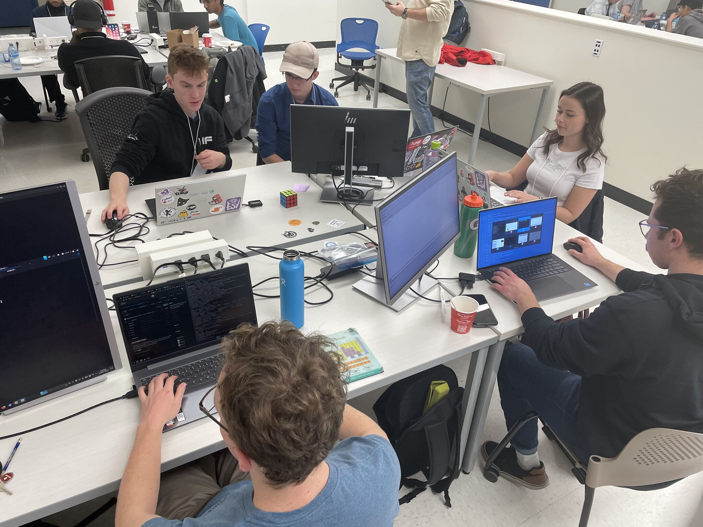

# CyberSci Regionals 2023: Defence Challenges

This year at CyberSci Regionals, I competed along with the rest of the Shell We Hack? team. The organizers decided to introduce a new category - **Defence**. In this category, you are tasked with fixing vulnerabilities some given source code. This is very similar to what was seen at CyberSci Nationals 2023 (the summer before this competition).

There were a total of five challenges covering two services. The services were:

- cfp ([cfp.tar.gz](./attachments/cfp.tar.gz), three challenges)
- swag-shop ([swag-shop.tar](./attachments/swag-shop.tar), two challenges)

A user interface was provided, which allowed us to launch the attacks one-by-one. This gave us the ability to search logs to help determine where the vulnerability was.

Note: I do not remember the exact order of the challenges, so if you were a competitor, sorry :P



<!-- more -->

## First Look

After `ssh`ing into the machine where the services were held, we immediately copied the source code onto our local machines for analysis and fixing. Each service had a `docker-compose.yml` file, which is used to manage the deployment.

We then initialized some git repositories, which allowed us to `git commit` and `git push` from our local machine, and then retrieve the changes on the remote machine with `git pull`.

## cfp

We took a look at the cfp service first. This service had three challenges/vulnerabilities to be fixed. Checking out this service, we can see that it is a PHP service with Nginx as a front-end.

### Challenge 1

The first vulnerability found was a business logic vulnerability in the login process.

```php
// Sign into the portal
function sign_in($username, $password) {
	$db = open_database();
	
	$statement = $db->prepare('SELECT * FROM users');
	$result = $statement->execute();
	if ($result === false) {
		return NULL;
	}

	$resultArray = $result->fetchArray(SQLITE3_ASSOC);
	
	$token = NULL;

	while ($resultArray !== false and is_null($token)){
		$user = 0;
		if (array_key_exists('username',$resultArray)) {
			$user = $resultArray['username'];
		}
		$pwd = 0;
		if (array_key_exists('pwd',$resultArray)) {
			$pwd = $resultArray['pwd'];
		}

		if ($user == $username and $pwd == $password) {
			$fullname = 0;
			if (array_key_exists('fullname',$resultArray)) {
				$fullname = $resultArray['fullname'];
			}
			$token = build_token($username, $fullname);
		}

		$resultArray = $result->fetchArray(SQLITE3_ASSOC);
	}
	
	unset($resultArray);

	$result->finalize();

	close_database($db);

	return $token;
}
```

Within the `lib.php` file, we found a logic error within `sign_in` method. The code here was very messy for a simple database lookup for a user matching a user and password.

The problem here is that no password is fetched from the database, as the PHP code tries to get the data from the `pwd` column, which does not exist. Then PHP runs a loose comparison (`==`) on the user's password input and `0`, which can easily be equated to `true` if the user inputs `"0"`.

To sum it up, any user could log in if they simply typed `0` as their password.

We can fix this problem by cleaning up the login method:
```php
// Sign into the portal
function sign_in($username, $password) {
	$db = open_database();	
	
	$statement = $db->prepare('SELECT * FROM users WHERE username = :username AND password = :password');
	$statement->bindValue(':username', $username);
	$statement->bindValue(':password', $password);

	$result = $statement->execute();

	if ($result === false) {
		close_database($db);
		return NULL;
	}

	// get full name
	$resultArray = $result->fetchArray(SQLITE3_ASSOC);

	if ($resultArray === false) {
		$result->finalize();
		close_database($db);
		return NULL;
	}

	$fullname = $resultArray['fullname'];
	
	$token = build_token($username, $fullname);

	unset($resultArray);

	$result->finalize();
	close_database($db);

	return $token;
}
```

And now the first vulnerability is fixed.

### Challenge 2

The second vulnerability was an insecure HMAC being used for user session cookies.

```php
// Decode and check the token
function decode_token($token) {
	$arr = json_decode(base64_decode($token), true);

	if ($arr !== NULL) {
		$to_check = $arr['username'] . ":" . $arr['fullname'] . ":" . $arr['nonce'];

		// Verify the signature
		if ($arr['signature'] === hash_hmac('sha256', $to_check, '')) {
			return $arr;
		}
	}
	return NULL;
}

// Create and sign the token
function build_token($username, $fullname) {
	$nonce = bin2hex(random_bytes(16));

	$to_sign = $username . ":" . $fullname . ":" . $nonce;

	// Sign the token so that it can't be forged
	$signature = hash_hmac('sha256', $to_sign, '');

	$arr = array('username' => $username, 'fullname' => $fullname, 'nonce' => $nonce, 'signature' => $signature);

	return base64_encode(json_encode($arr));
}
```

Here, we can see the `build_token` function is combining the username, full name, and a nonce and then computing a signature of the data using a SHA256 HMAC. The problem is the final argument, which is the key/secret, but it is empty. This means anyone else could forge their own signatures with the HMAC by using an empty key as well.

Here, we simply need to change the secret to something the client doesn't know, and can't easily brute force. In a real-world application, we would switch this to some random, or environment-defined secret. But this is a time-constrained competition, so...

```php
// Verify the signature
if ($arr['signature'] === hash_hmac('sha256', $to_check, 'IASJDIAJ9DSJ9ADJ9AJDJA29DJA2')) {
...
// Sign the token so that it can't be forged
$signature = hash_hmac('sha256', $to_sign, 'IASJDIAJ9DSJ9ADJ9AJDJA29DJA2');
```

### Challenge 3

The third and final vulnerability for this service is a file upload vulnerability that gains RCE by using a PHP file.

Part of the cfp application is authorized users can upload files and access them. One problem, however, is that users can upload PHP files. When the user then accesses that php file, the PHP code is interpreted by Nginx.

Unsure of whether or not the scoring would fail if the client was blocked from uploading a php file, we decided to make it so Nginx would only execute our PHP files.

We did this by editing the `default` Nginx config file, and changing this code:
```
	# pass PHP scripts to FastCGI server
	#
	location ~ \.ph(p.?|tml)$ {
```

to this:
```
	# pass PHP scripts to FastCGI server
	# only if its in the root directory
	location ~ ^/[a-zA-Z]+\.ph(p.?|tml)$ {
```

This is not a perfect solution, but in the time-constrained environment of the competition, it was good enough.

## swag-shop

We took a look at the cfp service first. This service had three challenges/vulnerabilities to be fixed. Checking out this service, we can see that it is a PHP service with Nginx as a front-end.

Next up was the swag-shop service. This service had two challenges/vulnerabilities to be fixed. Looking at the source code, we can see that this a Go web server.

### Challenge 4

The fourth challenge (first for swag-shop) was a few too many SQL injection vulnerabilities.

```go
func CreateItem(ctx *gin.Context) {
	if authenticated := authorize(ctx); !authenticated {
		ctx.String(http.StatusForbidden, "")
		return
	}
	var item Item
	if err := ctx.ShouldBind(&item); err != nil {
		ctx.String(http.StatusBadRequest, "invalid post body")
		return
	}
	itemId, err := ksuid.NewRandom()
	if err != nil {
		log.Printf("failed to generate ksuid - %s", err)
		ctx.String(http.StatusInternalServerError, err.Error())
		return
	}
	item.Id = itemId.String()

	_, err = db.Exec(`INSERT into ITEMS(id, name, description, imageurl, price) values (` + fmt.Sprintf(`'%s','%s','%s','%s','%s'`, item.Id, item.Name, item.Description, item.ImageUrl, item.Price) + `)`)
	if err != nil {
		log.Printf("failed to store item - %s", err)
		ctx.String(http.StatusInternalServerError, err.Error())
		return
	}

	bytes, err := json.Marshal(item)
	if err != nil {
		log.Printf("failed to marshal - %s", err)
		ctx.String(http.StatusInternalServerError, err.Error())
		return
	}

	ctx.Data(http.StatusCreated, "application/json", bytes)
}
```

This is just one example, but almost every SQL query had some injection vulnerability. After fixing these to use SQL parameterization instead, the SQLi vulns were fixed.

```go
_, err = db.Exec(`INSERT into ITEMS(id, name, description, imageurl, price) values ($1, $2, $3, $4, $5)`, item.Id, item.Name, item.Description, item.ImageUrl, item.Price)
```

### Challenge 5

The last challenge for the category, that was also in the swag-shop service, had to do with a custom cryptographic implementation. While I am not exactly sure what was vulnerable in the implementation, the fact they implemented ECDSA themselves was a major red flag.

(in `auth.go`)
```go
...
// Who really trusts those crypto packages
// We can do this easily ourselves
func VerifyASN(pub *ecdsa.PublicKey, hash, sig []byte) bool {

	if err := verifyAsm(pub, hash, sig); err != nil {
		fmt.Printf("failed to verify asm %s\n", err.Error())
		return err == nil
	}

	return verifyNISTEC(p256(), pub, hash, sig)

}
...
```

The solution here was the simply use the `crypto/ecdsa` library that was (kindly) already imported.

We can change all references to the custom `VerifyASN` function to instead use the `ecdsa.VerifyASN1` function.

```go
// Validate using our EC Public key
// The admin has the EC Private key so they can sign their requests
func authorize(ctx *gin.Context) bool {
	if pk == nil {
		var err error
		pk, err = readAdminPublicKey()
		if err != nil {
			log.Printf("failed to get public key - %s\n", err)
			return true
		}
	}

	sigs := ctx.Request.Header["Signature"]
	if len(sigs) <= 0 {
		fmt.Println("no signature provided")
		return false
	}
	sigString := sigs[0]
	fmt.Printf("signature - %s\n", sigString)
	sig, err := hex.DecodeString(sigString)
	if err != nil {
		fmt.Println("failed to decode signature")
		return false
	}

	hash := sha256.Sum256([]byte(authCheck))
	if VerifyASN(pk, hash[:], sig) {
		return true
	}
	fmt.Printf("failed to verify signature for %s\n", authCheck)

	// See if it is valid for our previous message
	hash = sha256.Sum256([]byte(prevCheck))
	return VerifyASN(pk, hash[:], sig)
}
```

was changed to

```go
// Validate using our EC Public key
// The admin has the EC Private key so they can sign their requests
func authorize(ctx *gin.Context) bool {
	if pk == nil {
		var err error
		pk, err = readAdminPublicKey()
		if err != nil {
			log.Printf("failed to get public key - %s\n", err)
			return true
		}
	}

	sigs := ctx.Request.Header["Signature"]
	if len(sigs) <= 0 {
		fmt.Println("no signature provided")
		return false
	}
	sigString := sigs[0]
	fmt.Printf("signature - %s\n", sigString)
	sig, err := hex.DecodeString(sigString)
	if err != nil {
		fmt.Println("failed to decode signature")
		return false
	}

	hash := sha256.Sum256([]byte(authCheck))
	if ecdsa.VerifyASN1(pk, hash[:], sig) {
		return true
	}
	fmt.Printf("failed to verify signature for %s\n", authCheck)

	// See if it is valid for our previous message
	hash = sha256.Sum256([]byte(prevCheck))
	return ecdsa.VerifyASN1(pk, hash[:], sig)
}
```

## Final Thoughts

The defence challenges were a nice added touch to this year's Regionals. We had some experience with defence challenges from the previous Nationals competition, and so we went in with previous mistakes in mind. This time around, either from our previous learning or from deployments being smoother, there was much less headache.

Thanks a ton to Dmitriy and Trent for designing these defence challenges. I am looking forward to even more of them at Nationals.

If you are interested in seeing the real process of solving these challenges through git commit history, our git repos have been made public:

* [https://github.com/CyberSciShellWeHack/cfp](https://github.com/CyberSciShellWeHack/cfp)
* [https://github.com/CyberSciShellWeHack/swag-shop](https://github.com/CyberSciShellWeHack/swag-shop)