# CyberSci Hardware Challenge

**Difficulty:** Medium/Hard

The objective of the challenge is to dump the firmware from the provided hardware badge and reverse engineer it. In theory this is quite easy, however it took quite some time to get familiar with the AVR architecture and instruction set.

*Hints: If you're just starting out, ask Jeff Bezos for help. If you're near the end, ask Jeff Bezos for help.*

## The Badge


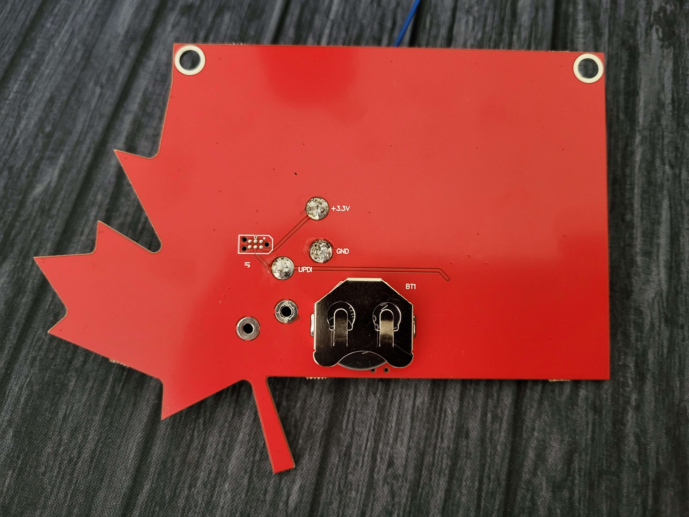
(ignore the soldering, that will come later)

Upon inital inspection we can see the board has been nicely labelled for us. There is also a small push button, a power switch, some LED's/resistors, and an IC chip present.

When powered on, the badge will cycle through different light patterns each time the small push button is pressed. 

The lights didn't seem to provide a pattern - that would be too easy. So we know the challenge must be hidden in the firmware.

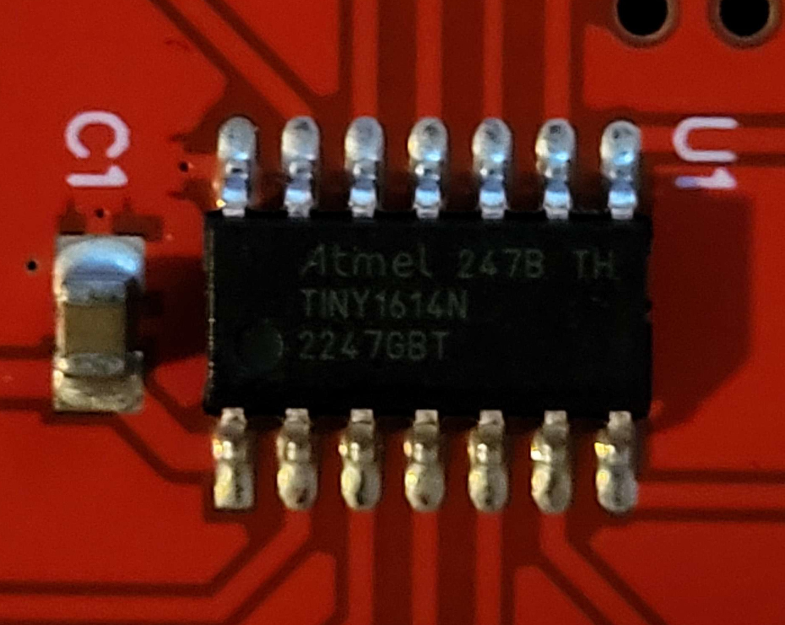

The chip has some small writing on the casing, and we can make out "TINY1614N". Googling around for it quickly reveals [the documentation](http://atmel-studio-doc.s3-website-us-east-1.amazonaws.com/webhelp/GUID-C541EA24-5EC3-41E5-9648-79068F9853C0-en-US-3/index.html?GUID-80E49755-C75C-4135-83B6-F7A7926186F8) (hosted on AWS, hence the hint), which explains that we can interact with it via the UPDI (Unified Program and Debug Interface).

## Dumping the firmware

### What's UPDI?

Taken straight from the documentation: UPDI is a Microchip TM (formerly Atmel) proprietary interface for external programming and on-chip debugging of a device. 

It operates over a one-wire interface, so other than hooking up GND and VCC (the power supply), there is minimal setup required.

### Interfacing with the badge

Luckily, the challenge creator ([Loudmouth Security](https://www.loudmouth.io/)) graciously connected the UPDI pinout into the single wire interface for us, so other than connecting GND and VCC we don't have to do much more for setup.

After conducting some research, tools such as [`avr-dude`](https://github.com/avrdudes/avrdude) and [`updiprog`](https://github.com/Polarisru/updiprog) quickly became of interest as they seemed to be capable of dumping the firmware.

### First Attempt

Originally, it was thought that an Arduino Uno (or alike) could be converted into a USB to TTL (aka serial) adapter to enable communication with the chip.

After reading several guides of people looking to program various chips via UPDI, the following schematic seemed to be accurate.

```
                        VCC       (3.3v)        VCC
                         +-----------------------+
                         |                       |
 +---------------------+ |                       | +--------------------+
 | Serial Adapter      +-+      Resistor         +-+  AVR device        |
 |                     |      +----------+         |                    |
 |                  TX +------+ 1k OHM   +---------+ UPDI               |
 |                     |      +----------+    |    |                    |
 |                     |                      |    |                    |
 |                  RX +----------------------+    |                    |
 |                     |                           |                    |
 |                     +--+                     +--+                    |
 +---------------------+  |                     |  +--------------------+
                          +---------------------+
                         GND                   GND
```

However, communication using an Arduino was unsuccessful for a various reasons. 

Rather than wasting time trying to mimic the required chipset, [this adapter](https://www.amazon.ca/dp/B07WX2DSVB) was purchased off Amazon for around $20 CAD. Yet another reference to asking Jeff Bezos for help.

Any USB to TTL UART adapter may be equally likely to work, we simply used the adapter linked above. A [search for "USB to TTL UART" on Amazon](https://www.amazon.ca/s?k=usb+to+ttl+uart) returns plenty of valid results.

### Second Attempt: Success!

After an agonizing couple days wait (we were excited!), the adapter arrived and necessary drivers were installed. There were issues with [`avr-dude`](https://github.com/avrdudes/avrdude) and [`updiprog`](https://github.com/Polarisru/updiprog), so a switch to [`pymcuprog`](https://pypi.org/project/pymcuprog/) was made.

We setup the same circuit as above on a breadboard, and are now ready to try dumping the firmware.

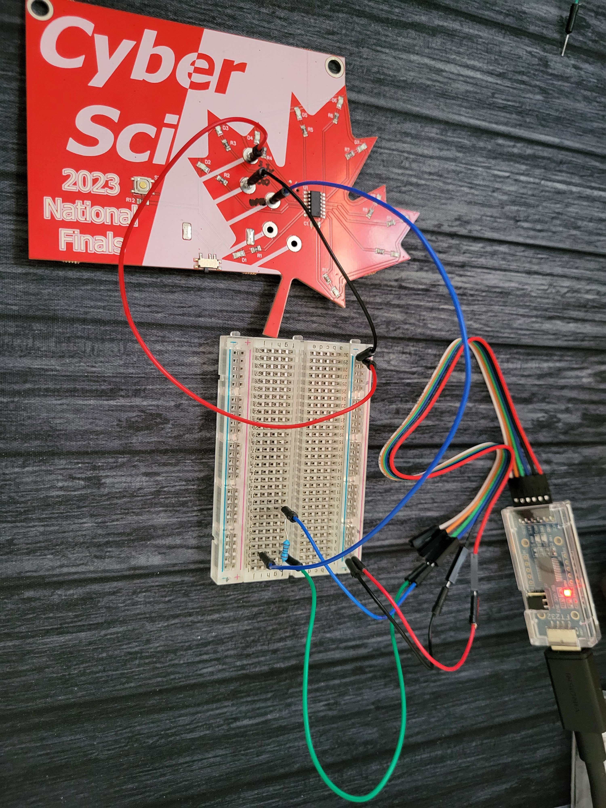

To test the connection, UPDI offers "ping" like functionality.

**Note: ```pymcuprog``` is the recommend tool to use as many others are outdated and slow.**

```
pymcuprog ping -d attiny1614 -t uart -u COM6
Connecting to SerialUPDI
Pinging device...
Ping response: 1E9422
Done.
```
Hurray! We can now talk to the device.

We want to dump both the firmware (the code), the EEPROM, and the SRAM (memory), as there may be valuable information in each.

```
pymcuprog read -m flash -d attiny1614 -t uart -u COM6 -f flash.hex
```
```
pymcuprog read -m eeprom -d attiny1614 -t uart -u COM8 -f eeprom.hex
```
```
pymcuprog read -m internal_sram -d attiny1614 -t uart -u COM6 -f sram.hex
```

Both of us were on opposite sides of Canada as we solved this. One of us (Stephen) had access to an Arduino kit with plenty of resistors. Matt, on the other hand, resorted to.. *other measures*.

The PCB from an old mini fridge had to be sacrificed to use a specific resistor, and made quite the interesting setup. But it worked!

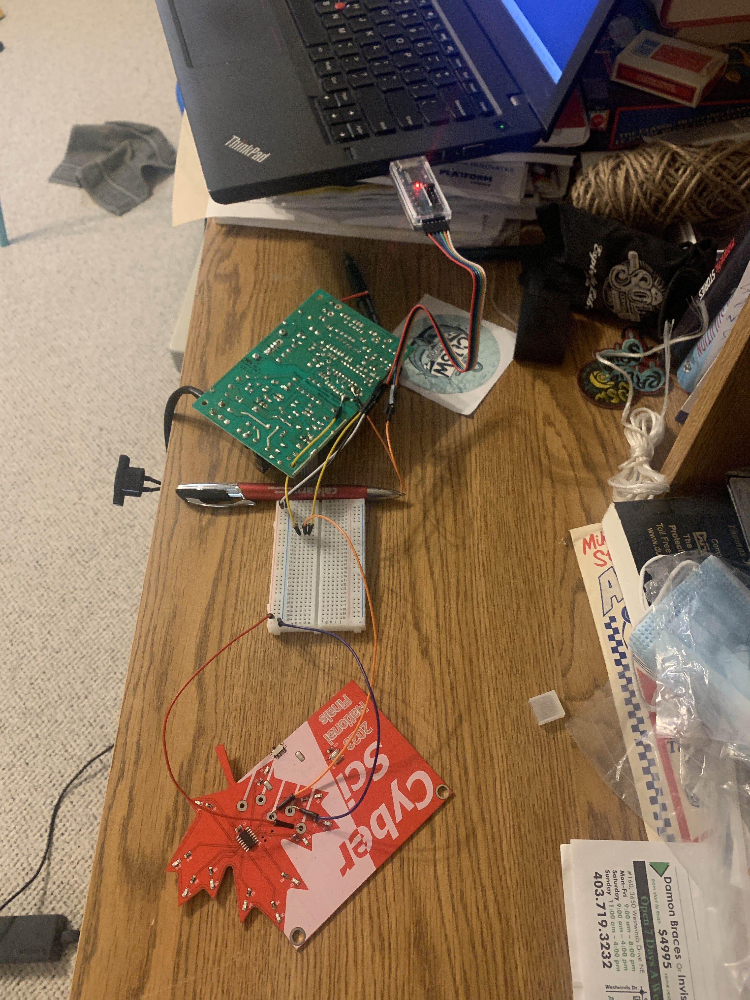

## Reversing the firmware

Before we can try reversing, we need to convert the files from intel hex into a binary format.

This can be done with the following tool:

```
avr-objcopy -I ihex -O binary flash.hex flash.bin
```

As mandated by CTF lore, `strings` was ran first and the following was spit out:

``` sh
$ strings flash.bin
...
0123456789abcdef
JIGGYCIPHER{
JIGGYCIPHER{a1557d3801d7723f3d385111d85cd125625cc260ba76d3051a5de6ff24786b8fc70c1659aa4c41b9151c8eef70d438515a6642562ab9f0403f276ba556a7429829433d2572484f2585719d468964832ab1a258521f568165c3ab1bead146ecd2de65a5d812b53ca5c168473bac895d4a8bc37390f860b11e6a6eb442c249180a9c337285455ab098d47b7264ec42bed7688d59dcdfddcf3d0de674356cbee22547e087c63be52013dc319600c4a4859788ab87349c6c81ea9598127f87093c148c1d3e94edea50132f324eaf5cc88b63b8fac20cf6}
```

Hurrah! We got our flag! Should be some simple cipher now and we'll be done.. right? Unfortunately, no. Little did we know, we had only solved the easy part.

SRAM and EEPROM were also quickly looked at in a hex editor. SRAM contained content but it was mostly binary, no text. EEPROM was quickly ruled out of having anything important as it was mostly 1s.

```sh
$ xxd sram.bin
00000000: b98f ca8f d78f 0100 0054 6f57 de1f 93ff  .........ToW....
00000010: e0fe 2ede feb2 3f7b ad7f 73d3 df15 3eff  ......?{..s...>.
00000020: 7e2f b78b cf8a 4cde 57ae fbaa e267 bffd  ~/....L.W....g..
...
```

```sh
$ xxd eeprom.bin
00000000: 0081 ffff ffff ffff ffff ffff ffff ffff  ................
00000010: ffff ffff ffff ffff ffff ffff ffff ffff  ................
00000020: ffff ffff ffff ffff ffff ffff ffff ffff  ................
00000030: ffff ffff ffff ffff ffff ffff ffff ffff  ................
...
```

### This has evolved into a Reversing/Crypto Challenge...

Any attempt to try and decode this using known ciphers fails, and performing frequency analysis yields no promising results.

Maybe there is some sort of encryption routine in the firmware!

### Ghidra to the rescue?

Ghidra does support the AVR architecture, however there is no direct support for the ATTINY1614 CPU.

To get Ghidra to work with AVR, however, you need to install the languages.

1. Download the Ghidra source code.
2. Copy the `Ghidra/Processors/Atmel` directory into your Ghidra installation's Processors directory at `ghidra_X.X_PUBLIC/Ghidra/Processors`.
3. Restart Ghidra and now you can select the AVR languages when importing a file.

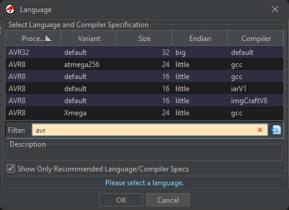

After reading the documentation, we found that the language was `AVR8:Little Endian:16 Bit` and it was compiled with GCC (uses `avr-libc`).

The memory mapping was very messed up, and Ghidra created lots of weird memory segments. This is due to the fact that AVR uses a Harvard architecture, meaning that **the program code and memory are stored in separate physical locations, and have completely different addresses**. This is a nightmare for all pwn people, but it simplifies reversing for us, as we know the code in the flash is the only code that can be ran.

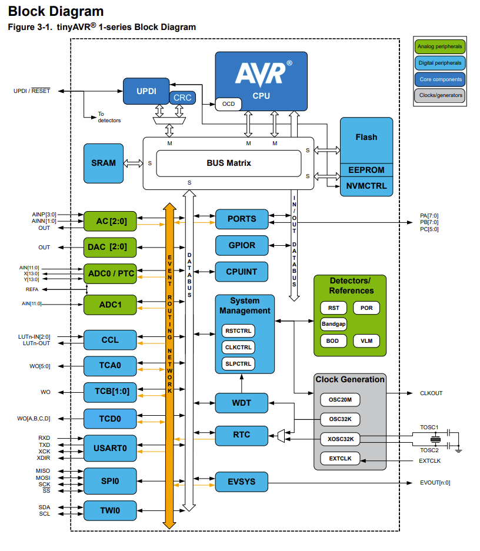

The SRAM and EEPROM dumps were added into the analysis of the flash in Ghidra via `File > Import File`. Using `Options...`, we could specify the address of the imported file, and input the real addresses of the dumps:
* EEPROM: `0x1400 - 0x14FF`
* SRAM: `0x3800 - 0x3FFF`
* Flash: `0x8000 - ...`

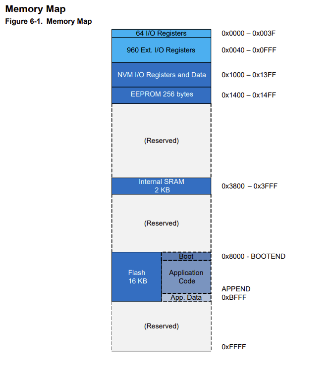

After importing the SRAM and EEPROM dumps and adjusting the memory mapping, the disassembly was still very hard to read. Ghidra's decompiler couldn't handle AVR, and after some time, we noticed some of the instructions were simply wrong (see below: Radare2 on top vs. Ghidra on bottom). Purely static analysis was also difficult, as we had no way to simulate the code. Ghidra has no emulator for AVR.

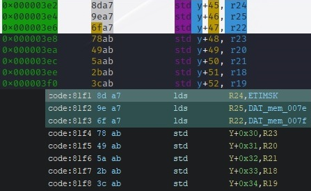

### Static Analysis? Nah. Let's Emulate it!

There are few ways emulation can be done, however [Cutter](https://github.com/rizinorg/cutter) was used as it was super user-friendly only required a simple installation.

[simavr](https://github.com/buserror/simavr) was another tool we tried, but it requires you to build/define custom core for emulation. We tried, at first, but Cutter seemed much simpler so we pivoted.

### The First Clue: References to JIGGYCIPHER

Despite its flaws, Ghidra did have some nice features that Cutter lacked, and it provided us with our first clue.

When looking at references to the SRAM in Ghidra, we can see a lot of references to the first eight bytes:

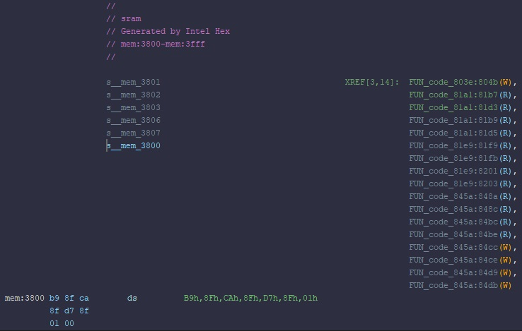

It tooked us a while to realize, but the contents of the SRAM at `x3800`, `x3802`, and `x3804` were addresses to the strings we saw before in little-endian format:

* `x3800`: `8fb9`
* `x3802`: `8fca`
* `x3804`: `8fd7`

Cutter mounts the flash at `x0000` instead of `x8000`, so we need to subtract `x8000` from each of these addresses in order to view the correct location. But when we do, we can see:

* `0x0fb9`: `0123456789abcdef`
* `0x0fca`: `JIGGYCIPHER{`
* `0x0fd7`: `JIGGYCIPHER{...}`

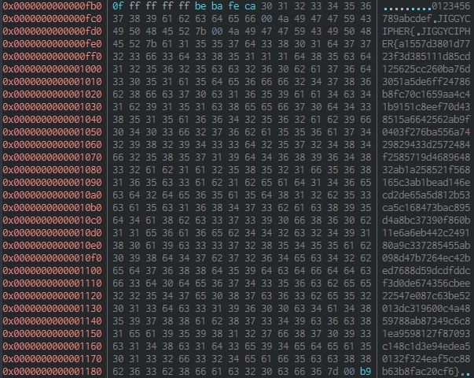

Why did we have to look up the strings in Cutter? Ghidra's addresses seemed mismatched from Cutter's, but Cutter's made more sense given the context.

Changing the data types to pointers allows us to see references to each individual string. By investigating each reference to the strings, we see a reference to `JIGGYCIPHER{` (`0x3802`) from `FUN_code_81e9`.

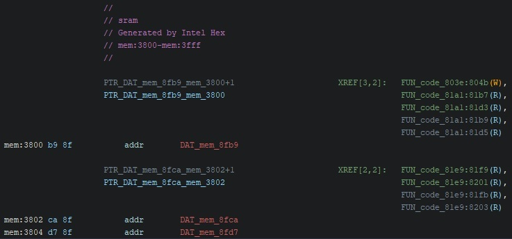

Then, using the instructions, we can search for the function in Cutter. It turns out the function is at `0x03d2`, but it is not defined as a function. Oh well, we can define it ourselves. Let's name it `refs_jiggy` as it references `JIGGYCIPHER{`.

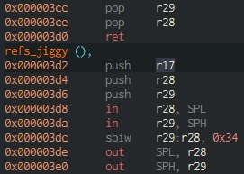

By switching to graph view, we can get a general idea of the function's working. We can see there is some init phase, followed by loop 1, then  loop 2, and finally the end of the function. Let's start analyzing what this function does.

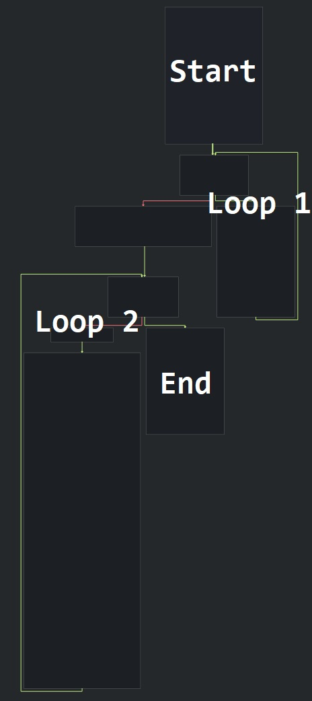

### RefsJiggy Analysis

Let's start by analyzing the first block. We start by breaking it up into it's pieces.

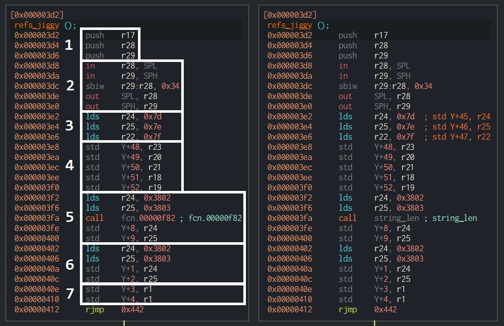

1. This block starts by preserving some registers on the stack.
2. Allocates 0x34 (52) places on the stack.
3. Loading something from data space addresses `0x7d`, `0x7e`, `0x7f`?? It turns out these instructions were incorrectly decompiled by Cutter (and Ghidra). The correct instructions have been commented in the version on the right.
4. Storing some registers in the stack. These are likely input parameters for the function, There are eight input registers, but AVR uses register pairs for two-byte words. So there are likely four input parameters. We will start a table, and update it as we move along and uncover some of their purposes.

| Parameter Name | Input Registers | Stack Location |
| -------------- | --------------- | -------------- |
| *unknown*      | `r25:r24`       | `Y+46,Y+45`    |
| *unknown*      | `r23:r22`       | `Y+48,Y+47`    |
| *unknown*      | `r21:r20`       | `Y+50,Y+49`    |
| *unknown*      | `r19:r18`       | `Y+52,Y+51`    |

5. Loads the pointer from address `0x3802` into `r25:r24`. We know the pointer at address `0x3802` is `0x0fca`, which points to `JIGGYCIPHER{`. Then this part calls some function at `0x0f82`, which after some quick analysis seems to be a string length function. Then some registers are stored on the stack, probably the return values from `string_len`.


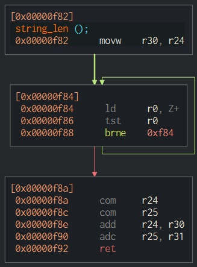

6. The pointer at address `0x3802` is loaded into `r25:r24` again, and is also stored on the stack.

7. `r1` is stored into `Y+3` and `Y+4` on the stack? Turns out, `r1` is used in this compilation as zero many times. So this part is simply setting those places on the stack to zero.

So far, it seems like the start phase stores some input parameters onto the stack and gets the length of the `JIGGYCIPHER{` string.

Now moving onto Loop 1.

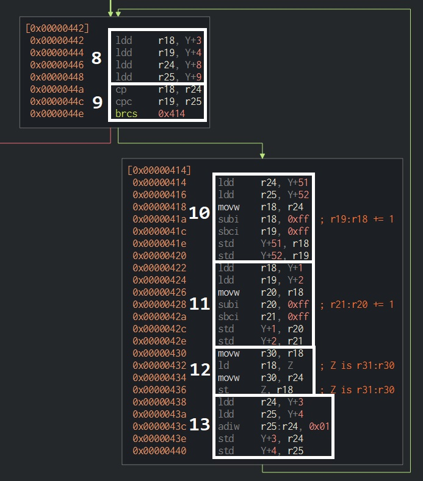

8. Loads some values from the stack. Referencing the start phase, we can tell `Y+9,Y+8` is the length of the `JIGGYCIPHER{` string. Also `Y+4,Y+3` starts as zero, and is probably the incremented variable (`i`) of this loop.

9. Compares `i` against `string_len('JIGGYCIPHER{')`. If `i` is less than the string length, it continues the loop.

10. Loads some value from `Y+52,Y+51`, increments by one, and saves back on the stack. The value (before being incremented) is stored in `r25:r24`.

11. Loads some value from `Y+2,Y+1`, increments by one, and saves back on the stack. The value (before being incremented) is stored in `r19:r18`.

12. Loads a byte from the address stored in `r19:r18` into register `r18`. Then it saves the byte in `r18` into the address stored in `r25:r24`. This is effectively copying a byte from the address in `r19:r18` to the address in `r25:r24`.

13. Increments `i` by one.

So it seems Loop 1 is copying the `JIGGYCIPHER{` string to some target address stored in `Y+52,Y+51`. It is important to note that Loop 1 is copying the **prefix** of JIGGYCIPHER, not the full flag-like string we saw before. As its copying the prefix, we can assume this is a function *generating* the flag-like string.

We know the generated string is being stored in the address in `Y+52,Y+51` which was one of our input parameters. Let's rename the entry in our parameter table to `output_string`.

| Parameter Name  | Input Registers | Stack Location |
| --------------- | --------------- | -------------- |
| *unknown*       | `r25:r24`       | `Y+46,Y+45`    |
| *unknown*       | `r23:r22`       | `Y+48,Y+47`    |
| *unknown*       | `r21:r20`       | `Y+50,Y+49`    |
| `output_string` | `r19:r18`       | `Y+52,Y+51`    |

http://www.mmajunke.de/doc0856.pdf