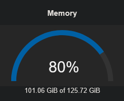
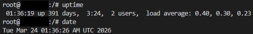

---
hide:
  - navigation
---

# Projects

## Home Lab

:fontawesome-regular-calendar-check: **Sept 2021 - Present**

I've built my homelab over the years. Now it runs on dedicated consumer hardware, hosting multiple services for myself and friends:

- Movies/shows (Jellyfin, *arr stack)
- Cloud-like file storage
- Code repositories
- Video game servers
- Personal automations
- Other shenanigans

Best investment I've ever made was 128 GB of ECC RAM in November 2024 (before the prices jumped).

## CyberSci | Challenge Designer

:fontawesome-solid-link: **[cybersci.ca](https://cybersci.ca)**

:fontawesome-regular-calendar-check: **Sept 2024 - Present**

I am a member of the CyberSci organizing team, primarily as a challenge designer. Specializing in Web and Crypto challenges, and helping with infrastructure when needed.

As a student, I competed in multiple regional and national CyberSci competitions from 2022 to 2024.

## Shell We Hack? | Member, Hacker

:fontawesome-solid-link: **[ctftime.org](https://ctftime.org/team/220236)**

:fontawesome-regular-calendar-check: **Mar 2023 - Present**

I am a member of the Shell We Hack? team, which mostly operates out of the UNB Cybersecurity Club. We compete in hacking competitions, such as CTFs.

## UNB Cybersecurity Club | Training Coordinator

:fontawesome-solid-link: **[unbcybersec.com](https://unbcybersec.com/)**

:fontawesome-regular-calendar-check: **Jul 2022 - May 2024**

The UNB Cybersecurity Club aims to provide students with resources and a safe environment to learn hands-on cybersecurity skills through participation in group training sessions and hacking challenges.

My position in the club is Training Coordinator. I develop and present training material for our members. This training material covers Linux skills, web security, reverse engineering, cryptography, and forensics.

I also help organize events for the club and advocate for sponsors.

## Snowfort 2024 | Organizer, Challenge Designer, Infrastructure

:fontawesome-solid-link: **[snowfort2024.cyberscoring.ca](https://snowfort2024.cyberscoring.ca)**, **[scoreboard archive](https://snowfort2024.cyberscoring.ca/global)**

:fontawesome-regular-calendar-check: **March 16, 2024**

Snowfort 2024 was a defensive cybersecurity competition where 35 teams across the globe were given five services with five vulnerabilities each.

An attack bot actively exploited each service. The teams were tasked with fixing the vulnerabilities while preserving normal user functions.

Infrastructure was hosted using (mostly) Google trial credits and was deployed using Terraform, hope, and a bit of duct tape. Teams were given VPN configs to connect to their environment, and SSH keys to connect to their virtual machines.

Services were custom written web applications with various functions.

An attack bot dedicated to each team would launch malicious and benign requests every minute (game tick). Teams gained points for blocking malicious requests while properly preserving benign requests.

## CyberScoring | Founder, Team Lead

:fontawesome-solid-link: **[cyberscoring.ca](https://cyberscoring.ca)**

:fontawesome-regular-calendar-check: **Sept 2023 - May 2024**

A project focused on improving Canada’s cybersecurity posture through engaging and competitive challenges. We help host cybersecurity competitions by designing challenges, implementing software-based scoring engines, and setting up related infrastructure.

I wear many hats at CyberScoring:

* I am the lead developer for our Windows/Linux security scoring engine.
* I coordinate with organizations to host competitions.
* I design challenges for our competitions.
* And I help wherever help is needed.

## Silk's Plugins | Owner

:fontawesome-brands-github: **[github.com/silksplugins](https://github.com/SilksPlugins/)**

:fontawesome-regular-calendar-xmark: **May 2020 - Oct 2022**

Developing server-side addons (plugins) for games using the OpenMod plugin framework. Both open-source and commission-based work. This project has since been retired and all owned IP has been [released to the open-source community](https://github.com/SilksPlugins/).

## OpenMod | Developer, Contributor

:fontawesome-brands-github: **[github.com/openmod](https://github.com/openmod/)**

:fontawesome-regular-calendar-xmark: **Jul 2020 - Oct 2022**

An open-source plugin framework for .NET using modern C# best practices. Primarily used for the game Unturned.

I helped develop and maintain the plugin framework and commonly used plugins. My contributions are rather infrequent now, and I mostly dedicate my time to newer projects.